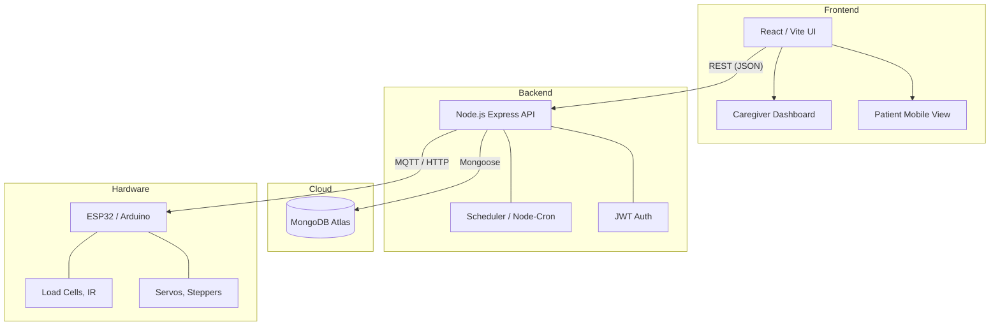

# Architecture Overview

This document provides a high-level overview of the MEDI-DISPENSE-V2 system architecture.

## System Diagram

## Component Details

- **Frontend**: The user interface is built as a single-page application (SPA) using React and Vite. It provides monitoring and configuration interfaces for both caregivers and patients.
- **Backend**: The core application logic runs on Node.js using Express. It handles HTTP requests, authenticates users, runs schedule cron jobs, and coordinates dispensing events.
- **Cloud Database**: MongoDB Atlas is used as the central datastore for users, medication schedules, prescriptions, and event logs.
- **Hardware**: The physical dispenser uses an ESP32 or similar microcontroller to actuate servos, check sensor data, and dispense the pill to the patient. It communicates with the backend via MQTT or HTTP endpoints.
